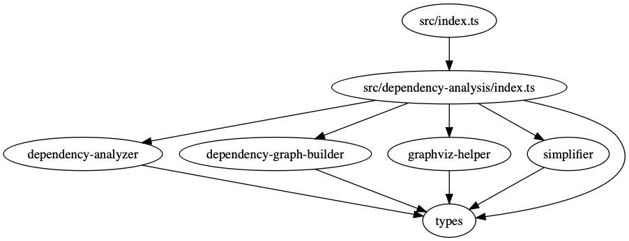
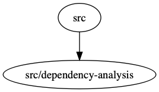

# tssa


TypeScript Static Analyzer

## Getting Started

```bash
# Clone this repository
cd tssa
yarn
yarn build
yarn start --project path/to/ts/project/to/analyze
```

## Supported Features

- Dependency graph generation
- Cyclic dependency detection

## Run `tssa` on `tssa`

Printed dependency graph:

```text
{ 'src/index.ts': [ 'src/dependency-analysis/index.ts' ],
  'src/dependency-analysis/dependency-analyzer.ts': [ 'src/dependency-analysis/types.ts' ],
  'src/dependency-analysis/dependency-graph-builder.ts': [ 'src/dependency-analysis/types.ts' ],
  'src/dependency-analysis/graphviz-helper.ts': [ 'src/dependency-analysis/types.ts' ],
  'src/dependency-analysis/index.ts':
   [ 'src/dependency-analysis/dependency-graph-builder.ts',
     'src/dependency-analysis/simplifier.ts',
     'src/dependency-analysis/dependency-analyzer.ts',
     'src/dependency-analysis/graphviz-helper.ts',
     'src/dependency-analysis/types.ts' ],
  'src/dependency-analysis/simplifier.ts': [ 'src/dependency-analysis/types.ts' ],
  'src/dependency-analysis/types.ts': [] }

{ src: [ 'src/dependency-analysis' ],
  'src/dependency-analysis': [] }
```

Module dependency graph:



Directory dependency graph:


